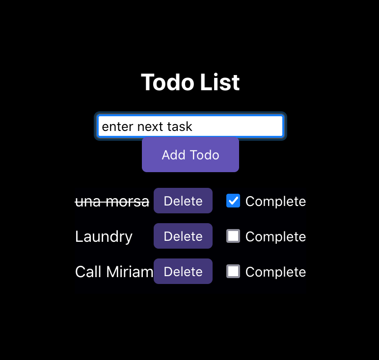

# ToDoList - RESTful API

The ToDoList app is a RESTful web application following the Model-View-Controller (MVC) architecture. The backend, powered by Node.js and Express.js, offers a RESTful API for managing tasks. It utilizes MongoDB as the database for storing task data, with models defining the schema and structure of the data.



The backend controllers handle incoming requests, interacting with the models to perform CRUD (Create, Read, Update, Delete) operations on tasks. The API endpoints are designed to adhere to RESTful principles, providing predictable and consistent interfaces for client applications.

On the frontend, the app is built with React.js to create a dynamic and interactive user interface. Components such as Greeting and TodoList are responsible for rendering views and managing user interactions. React Router is used for client-side routing, enabling navigation between different views without full page reloads.

The app is tested using Jest. Test suites ensure that the API endpoints behave correctly, database operations are performed accurately.

## Getting Started

To get started with the application, follow these steps:

1. Clone the repository to your local machine.

2. Install the required dependencies by running the following command:

   ```bash
   npm install

3. Build the application using TypeScript by running:


   ```bash
   npm run build

4. To start the application, in the root folder type:


   ```bash
   npm start

5. Additionally, you can run the application using nodemon by executing the following command:


   ```bash
   npm run dev

This will start the application with nodemon, enabling automatic server restarts upon file changes, facilitating the development process.

You should see the messages "Server is running on port 3000" and "Connected to MongoDB" if the application is initialized correctly.

5. Open your web browser and visit http://localhost:3000/ to access the front-end of the application.


<!-- ## Key Components -->


## MONGO_CONNECTION_STRING

    This project connects to MongoDB. You need to have a MONGO_CONNECTION_STRING for the connection to be established successfully.

## Dependencies

The project utilizes the following dependencies:

    dotenv: Loads environment variables from a .env file into process.env.
    mongoose: MongoDB object modeling tool designed to work in an asynchronous environment.
    body-parser: Middleware to parse incoming request bodies in a middleware before the handlers.
    @types/dotenv: Type definitions for the dotenv package.
    @types/mongoose: Type definitions for the mongoose package.
    path: Provides utilities for working with file and directory paths.

## Development Dependencies

The project uses the following development dependencies:

    @babel/core: Babel compiler core package.
    @babel/preset-env: Babel preset for compiling modern JavaScript down to a version that is compatible with specified browser environments.
    @babel/preset-typescript: Babel preset for TypeScript.
    @types/express: Type definitions for the Express.js library.
    @types/jest: Type definitions for Jest.
    @types/supertest: Type definitions for Supertest.
    babel-jest: Jest transformer for Babel.
    express: Fast, unopinionated, minimalist web framework for Node.js.
    jest: JavaScript testing framework.
    supertest: Super-agent driven library for testing HTTP servers.
    ts-jest: Jest transformer with TypeScript support.
    ts-node: TypeScript execution and REPL for Node.js.
    typescript: TypeScript language compiler.

## Testing

To run the tests, use the following command:

    npm test

The tests are written using Jest and are located in the __tests__ directory.


## Contribution

to this project are welcome! If you find any issues or want to add new features, feel free to create a pull request or submit an issue.

## License

This project is licensed under the MIT License.


Happy ToDoListing! 🚀


